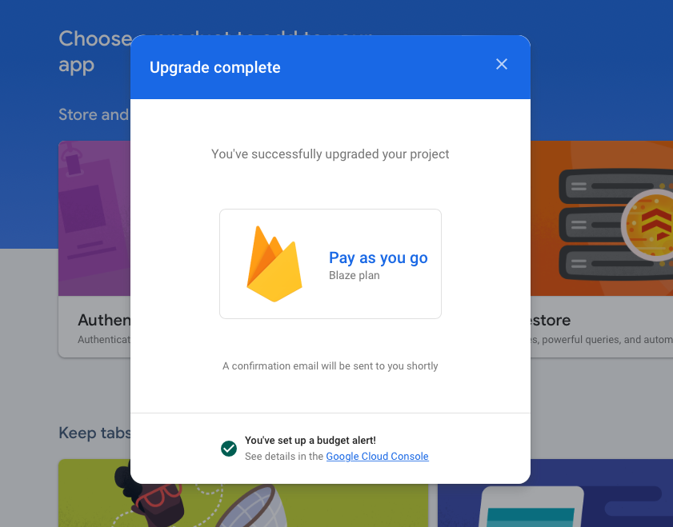
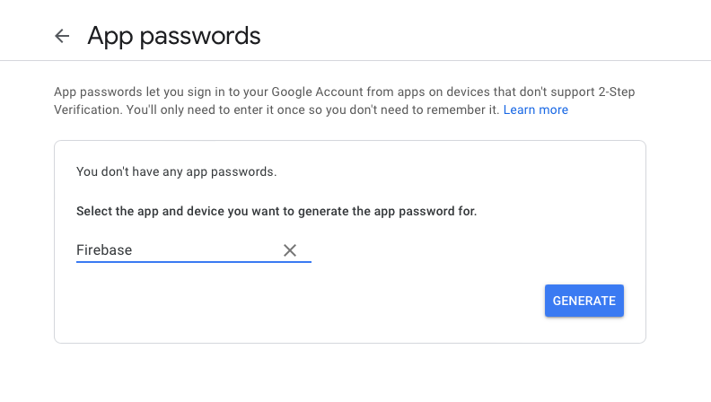
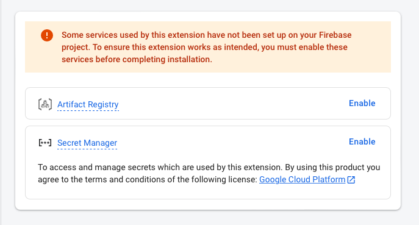
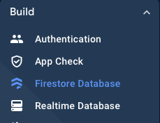
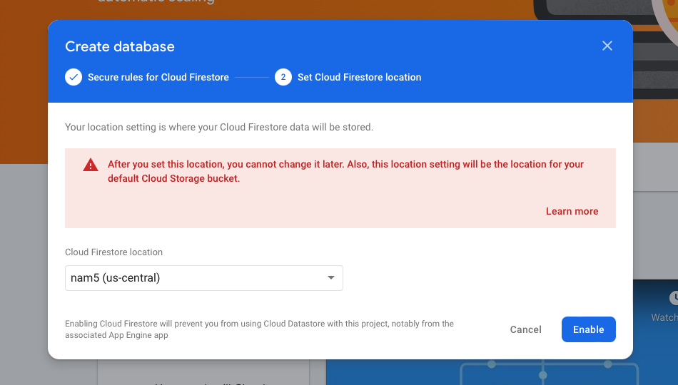
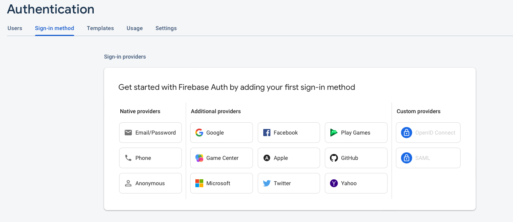
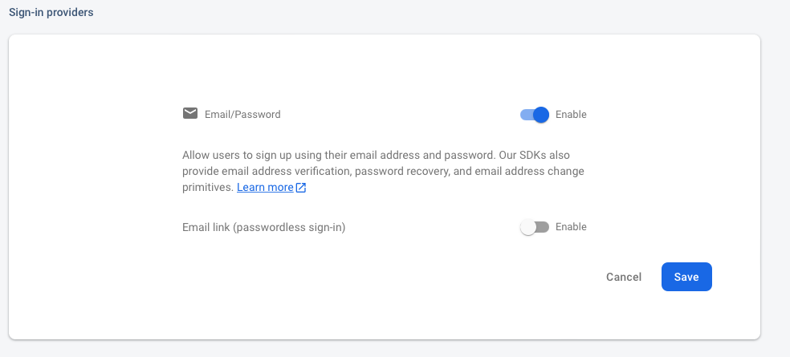

## Introduction

FBLA Chapter Management Platform
-  FBLA competitive event signup
  - Emails to teams
  - Group validation
  - Intro event validation
  - Automatic in-house checking
  - Validation etc etc
- Chapter meetings scheduler
- Chapter meetings attendance platform
- Calendar integration for chapter meetings and any events/conferences


## Table of Contents

- [Developer](#developer)
- [License](#license)


## Installation & Project Configuration

### General Installation Steps

1. Fork this repo
2. Install **node.js**
 - Install node.js following these [instructions](https://nodejs.org/en/download/)
3. Clone the forked repo following these [steps under "Cloning a repository"](https://docs.github.com/en/repositories/creating-and-managing-repositories/cloning-a-repository#cloning-a-repository)
4. Opened the cloned repo in a code editor, like Webstorm, PyCharm, Atom, VSCode, etc.

### Setting up Firebase Console

3. Navigate to [Firebase Console](https://console.firebase.google.com/)
  - Sign into the Google account you would like to use to manage this platform
4. Click "Create New Project", entering the name of your chapter in lowercase (ex. washingtonfbla)
5. Uncheck the "Enable Google Analytics for this project" checkbox
6. Click "Create Project"
7. Navigate to "Project Overview"


8. Click on "web"


9. Enter chapter name as app nickname (ex. Washington FBLA) and check "Also set up Firebase Hosting for this app", and click Register


10. Ignore the code under "Add Firebase SDK" step. Instead, copy the code under "// Your web app's Firebase configuration"


11. Open your code editor with the project open (from the previous part) and create a new file called ".env" in the same level as chaptersUsing.txt


12. Copy the following code into the newly created .env file

```
REACT_APP_API_KEY=
REACT_APP_AUTH_DOMAIN=
REACT_APP_PROJECT_ID=
REACT_APP_STORAGE_BUCKET=
REACT_APP_MESSAGING_SENDER_ID=
REACT_APP_APP_ID=
```

13. Add the keys that you copied from step 10 into the .env file, WITH NO quotation marks (""). The final .env file should look like this...

```
REACT_APP_API_KEY=AIS92kmis-flKO-2Msk_sP092mf4
REACT_APP_AUTH_DOMAIN=washingtonfbla.firebaseapp.com
REACT_APP_PROJECT_ID=washingtonfbla
REACT_APP_STORAGE_BUCKET=washingtonfbla.appspot.com
REACT_APP_MESSAGING_SENDER_ID=1298038129
REACT_APP_APP_ID=9:2981238017:web:dj0293sl3989rbs92
```

14. You can save and close the .env file. Return to the Firebase Console and click next so you see this.


15. Open a terminal/cmd on your computer, navigate into the folder with your project, and run this code

`npm install -g firebase-tools`

16. Click next and skip the "Deploy to Firebase Hosting" section. Click the "Continue to console" blue button.


### Setting up Firebase Billing

17. Navigate to https://console.firebase.google.com/u/0/project/[CHAPTER NAME FROM STEP 4 HERE]/usage/details
18. On this page, click on "Modify plan" and then select "Blaze" "Pay as you go" plan.
20. Clicking "Continue" you should be taken to Google Cloud console to set up a billing account as seen below.


21. Follow the billing steps to set up a billing account - creating a Business account and linking a credit/debit card or bank account.
22. Once you finish, you will be taken back to Firebase Console.
23. (optional) Set a billing budget if asked
24. If you completed the steps correctly, you will see a popup similar to this.



### Setting up Email Service Provider
The project uses a Gmail service provider to be able to send automated emails when members create competitive event teams.

25. Open a new tab and navigate to Create a [New Google Account](https://accounts.google.com/signup)
26. Create a new Google account with the first name being your chapter name and last name being "FBLA"
27. Create the email following the following format `noreply.auto.[CHAPTER NAME IN LOWERCASE FROM STEP 4]@gmail.com` (ex. noreply.auto.washingtonfbla@gmail.com)
28. Create a password and save it (you will need this password in the future). Complete the rest of the account creation steps.
29. Turn on [2-Step verifcation for this new Google account (REQUIRED)](https://support.google.com/accounts/answer/185839?hl=en&co=GENIE.Platform%3DiOS&oco=0)
30. Navigate to App [Passwords](https://myaccount.google.com/apppasswords)
31. Create a new App Password for "Other (Custom name)", naming it "Firebase".



32. Click Generate, and save the app password that is in yellow. You will need this password in the future.
33. Navigate to [this link](accounts.google.com/b/0/DisplayUnlockCaptcha) and complete the steps.
34. Navigate to [Firebase Trigger Email Extension](https://firebase.google.com/products/extensions/firebase-firestore-send-email) and click "Install in console". Select your FBLA chapter firebase project from the list.
35. A 4-step set up window will open. Please read step 1, acknowledge, and click Next.
36. In Step 2, enable the following options, and then click Next.



37. Step 3 includes information about how Google Cloud permissions will be updated. You can read through this or ignore and click Next.
38. Step 4 will ask you to configure the extension. Fill in the following data into the respective fields, and leave all other fields that are not listed below blank. Click "Create secret" once you enter the SMTP password.
```
Cloud Functions location:   Iowa (us-central1)
SMTP connection URI:        smtps://[EMAIL FROM STEP 27 HERE]@smtp.gmail.com:465
SMTP password:              [APP PASSWORD FROM STEP 32]
Email documents collection: mail
Default FROM address:       [CHAPTER NAME HERE] <[EMAIL FROM STEP 27 HERE]>
Default REPLY-TO address:   [CHAPTER/ADVISER EMAIL ADDRESS HERE]
Templates collection:       email_templates
```
Example:
```
Cloud Functions location:   Iowa (us-central1)
SMTP connection URI:        smtps://noreply.auto.washingtonfbla@gmail.com@smtp.gmail.com:465
SMTP password:              ksloeptnsjeiomgs
Email documents collection: mail
Default FROM address:       Washington FBLA <noreply.auto.washingtonfbla@gmail.com>
Default REPLY-TO address:   washingtonfbla.chapter@gmail.com
Templates collection:       email_templates
```
39. Click on "Install extension" and wait 3-5 minutes as it installs into your project.

### Setting up Firebase Firestore and Authentication services

40. Navigate to the Firestore Database tab under Build.



41. Click "Create Database" and click "Next" without changing anything under "Secure rules for Cloud Firestore".
42. On step 2, ensure the Cloud Firestore location is nam5 (us-central) and click Enable.



43. Navigate to "Authentication" under "Build" (left side bar), similar to step 40.
44. Click "Get started". Click on "Email/Password" option as shown below.



45. Enable ONLY the first option, and click Save.



### Completing Project Set Up

46. Navigate back to your project in your code editor.
47. Edit the settings.js file under `src/settings.js`
  - You can edit these variables in this file to customize the look and information on the platform.
48. Add your chapter images under `/src/assets`
'''
chapter-icon.png
landing-page-img.jpg
logo.svg
'''
will need to be updated. You can convert a regular image to SVG using [this online converter](https://convertio.co/jpg-svg/).
49. Once you have updated these files, complete the following commands in a Terminal/CMD window in your project folder.
`npm install`


### Last steps
NUMBER. Navigate to [chaptersUsing.txt](https://github.com/akjadhav/FBLA-Chapter-Management-Platform/blob/main/chaptersUsing.txt)


---


* Set up cloud functions

```
firebase login
firebase init
firebase deploy
```
* Set up settings.js file
* Node script to create db collections (probably only db_store and email_templates)

---
Notes:

* Install Node.js
* Set up Firebase project
* Set up Cloud billing
* Set up .env db tokens

* Set up cloud functions
* Set up Firebase
* Set up STMP email service
* Install firebase email extension
 * Create new Gmail account
 * Enable 2FA
 * Create App Password
 * Visit accounts.google.com/b/0/DisplayUnlockCaptcha


* (possibly) set up Github actions ???? - Need to add github secrets
* Set up settings.js file
* Update images - /src/assets (https://github.com/akjadhav/FBLA-Chapter-Management-Platform/tree/master/src/assets)
  * chapter-icon.png
  * landing-page-img.jpg
  * logo.svg
* Update chaptersUsing.txt
* Node script to create db collections (probably only db_store and email_templates)


## Available Scripts for npm <a name = "npm_scripts"></a>

In the project directory, you can run:

### `npm start`

Runs the app in the development mode.\
Open [http://localhost:3000](http://localhost:3000) to view it in your browser.

The page will reload when you make changes.\
You may also see any lint errors in the console.

### `npm test`

Launches the test runner in the interactive watch mode.\
See the section about [running tests](https://facebook.github.io/create-react-app/docs/running-tests) for more information.

### `npm run build`

Builds the app for production to the `build` folder.\
It correctly bundles React in production mode and optimizes the build for the best performance.

The build is minified and the filenames include the hashes.\
Your app is ready to be deployed!

See the section about [deployment](https://facebook.github.io/create-react-app/docs/deployment) for more information.


## Developer <a name = "developer"></a>

[Ameya Jadhav](http://ameyajadhav.su.domains) of [Ameya Labs](https://www.linkedin.com/company/ameya-labs)


## License <a name = "license"></a>

This project is licensed under the terms of the [MIT license](https://github.com/akjadhav/FBLA-Chapter-Management-Platform/blob/main/LICENSE.md).
