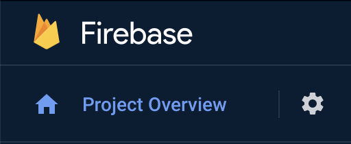
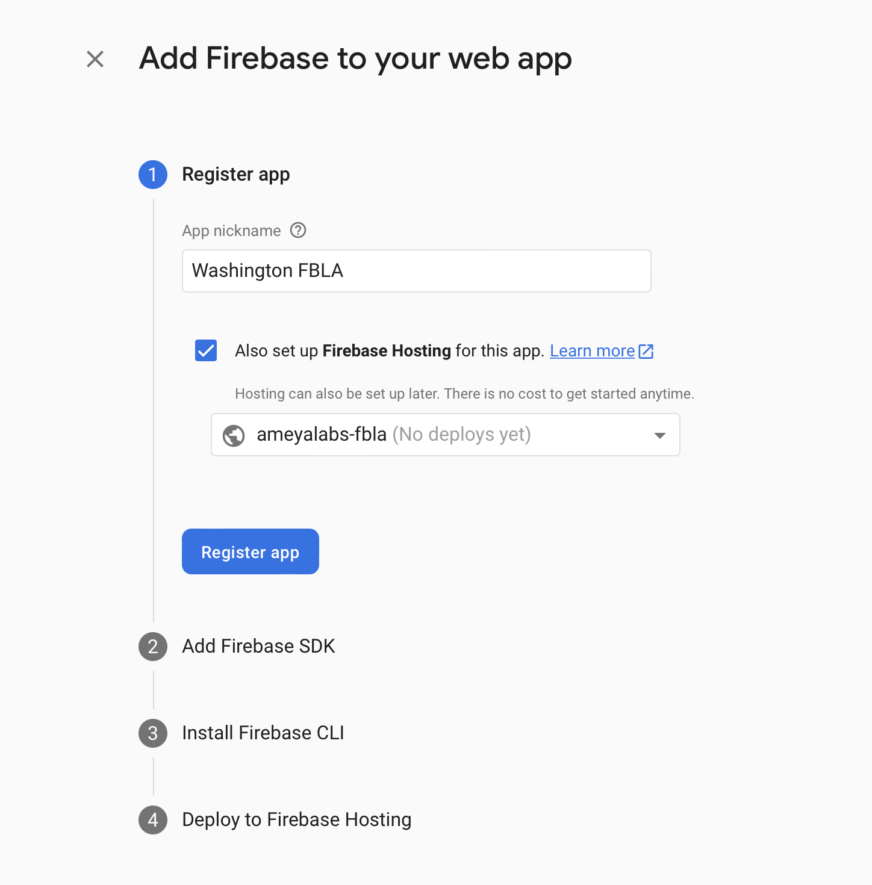
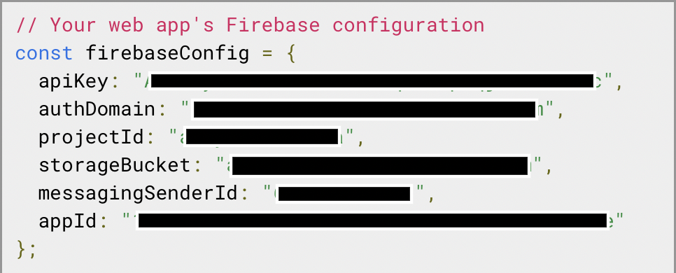
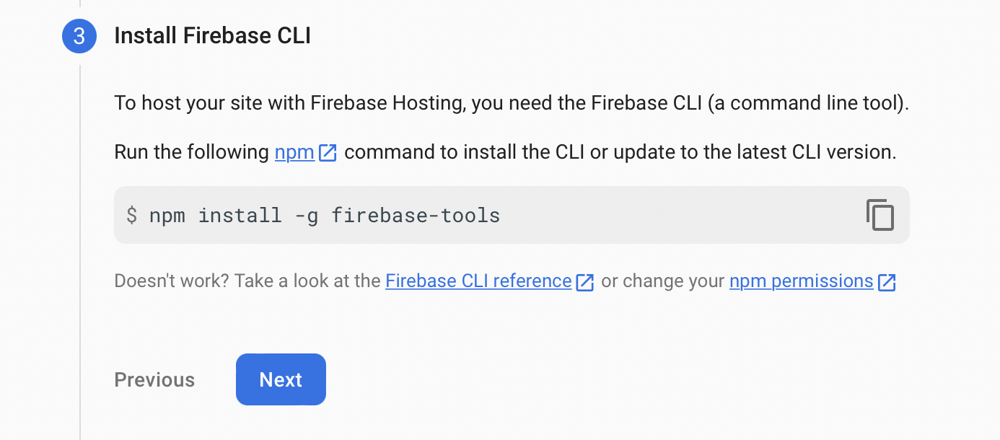
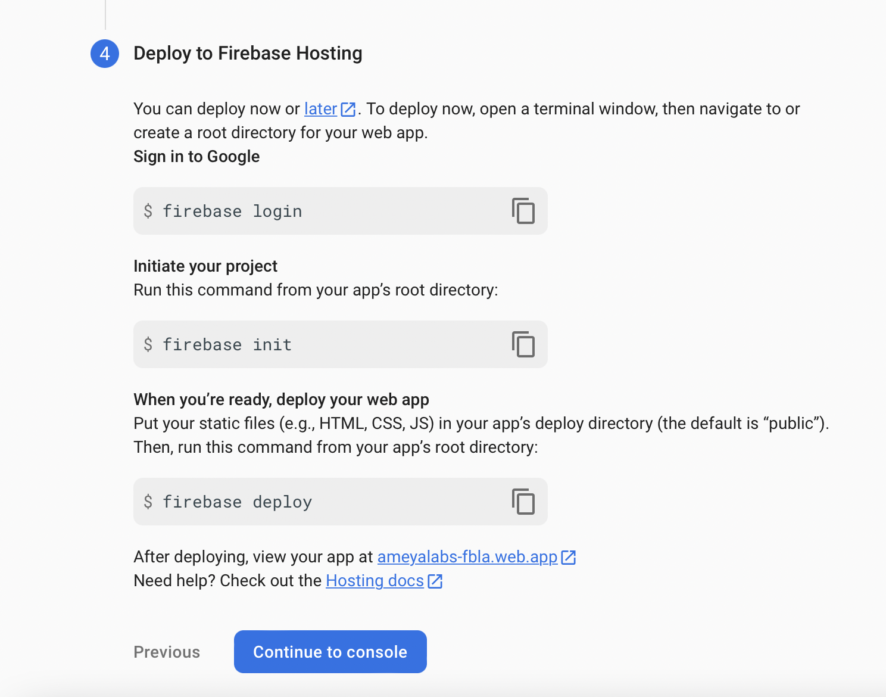

## Introduction

FBLA Chapter Management Platform
-  FBLA competitive event signup
  - Emails to teams
  - Group validation
  - Intro event validation
  - Automatic in-house checking
  - Validation etc etc
- Chapter meetings scheduler
- Chapter meetings attendance platform
- Calendar integration for chapter meetings and any events/conferences


## Table of Contents

- [Developer](#developer)
- [License](#license)


## Installation & Project Configuration

### General Installation Steps

1. Fork this repo
2. Install **node.js**
 - Install node.js following these [instructions](https://nodejs.org/en/download/)
3. Clone the forked repo following these [steps under "Cloning a repository"](https://docs.github.com/en/repositories/creating-and-managing-repositories/cloning-a-repository#cloning-a-repository)
4. Opened the cloned repo in a code editor, like Webstorm, PyCharm, Atom, VSCode, etc.

### Setting up Firebase Console

3. Navigate to [Firebase Console](https://console.firebase.google.com/)
  - Sign into the Google account you would like to use to manage this platform
4. Click "Create New Project", entering the name of your chapter in lowercase (ex. washingtonfbla)
5. Uncheck the "Enable Google Analytics for this project" checkbox
6. Click "Create Project"
7. Navigate to "Project Overview"



8. Click on "web"


9. Enter chapter name as app nickname (ex. Washington FBLA) and check "Also set up Firebase Hosting for this app", and click Register



10. Ignore the code under "Add Firebase SDK" step. Instead, copy the code under "// Your web app's Firebase configuration"



11. Open your code editor with the project open (from the previous part) and create a new file called ".env" in the same level as chaptersUsing.txt


12. Copy the following code into the newly created .env file

```
REACT_APP_API_KEY=
REACT_APP_AUTH_DOMAIN=
REACT_APP_PROJECT_ID=
REACT_APP_STORAGE_BUCKET=
REACT_APP_MESSAGING_SENDER_ID=
REACT_APP_APP_ID=
```

13. Add the keys that you copied from step 10 into the .env file, WITH NO quotation marks (""). The final .env file should look like this...

```
REACT_APP_API_KEY=AIS92kmis-flKO-2Msk_sP092mf4
REACT_APP_AUTH_DOMAIN=washingtonfbla.firebaseapp.com
REACT_APP_PROJECT_ID=washingtonfbla
REACT_APP_STORAGE_BUCKET=washingtonfbla.appspot.com
REACT_APP_MESSAGING_SENDER_ID=1298038129
REACT_APP_APP_ID=9:2981238017:web:dj0293sl3989rbs92
```

14. You can save and close the .env file. Return to the Firebase Console and click next so you see this.



15. Open a terminal/cmd on your computer, navigate into the folder with your project, and run this code

`npm install -g firebase-tools`

16. Click next and skip the "Deploy to Firebase Hosting" section. Click the "Continue to console" blue button.




```
firebase login
firebase init
firebase deploy
```

---
Notes:

* Install Node.js
* Set up Firebase project
* Set up Cloud billing
* Set up .env db tokens

* Set up cloud functions
* Set up Firebase
* Set up STMP email service
* Install firebase email extension
 * Create new Gmail account
 * Enable 2FA
 * Create App Password
 * Visit accounts.google.com/b/0/DisplayUnlockCaptcha


* (possibly) set up Github actions ???? - Need to add github secrets
* Set up settings.js file
* Update images - /src/assets (https://github.com/akjadhav/FBLA-Chapter-Management-Platform/tree/master/src/assets)
  * chapter-icon.png
  * landing-page-img.jpg
  * logo.svg
* Update school info into .txt file
* Node script to create db collections (probably only db_store and email_templates)
* Update chaptersUsing.txt


## Available Scripts for npm <a name = "npm_scripts"></a>

In the project directory, you can run:

### `npm start`

Runs the app in the development mode.\
Open [http://localhost:3000](http://localhost:3000) to view it in your browser.

The page will reload when you make changes.\
You may also see any lint errors in the console.

### `npm test`

Launches the test runner in the interactive watch mode.\
See the section about [running tests](https://facebook.github.io/create-react-app/docs/running-tests) for more information.

### `npm run build`

Builds the app for production to the `build` folder.\
It correctly bundles React in production mode and optimizes the build for the best performance.

The build is minified and the filenames include the hashes.\
Your app is ready to be deployed!

See the section about [deployment](https://facebook.github.io/create-react-app/docs/deployment) for more information.


## Developer <a name = "developer"></a>

[Ameya Jadhav](http://ameyajadhav.su.domains) of [Ameya Labs](https://www.linkedin.com/company/ameya-labs)


## License <a name = "license"></a>

This project is licensed under the terms of the [MIT license](https://github.com/akjadhav/FBLA-Chapter-Management-Platform/blob/main/LICENSE.md).
